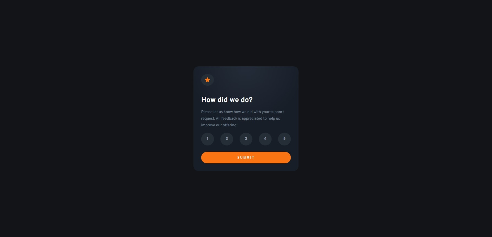

# Frontend Mentor -  Interactive rating component 

This is a solution to the [Interactive rating component  challenge on Frontend Mentor](https://www.frontendmentor.io/challenges/interactive-rating-component-koxpeBUmI).

## Table of contents

- [Overview](#overview)
  - [Screenshot](#screenshot)
  - [Links](#links)
- [My process](#my-process)
  - [Built with](#built-with)
  - [What I learned](#what-i-learned)
  - [Continued development](#continued-development)
  - [Useful resources](#useful-resources)
- [Author](#author)

## Overview

### Screenshot




## My process

### Built with

- Semantic HTML5 markup
- CSS custom properties
- Flexbox
- JavaScript

### What I learned

This project was one of the most difficult I have ever experienced. Mainly because of Javascript (this was my first Javascript project), I still have to learn a lot about Javascript, but I’ll make it :) I’m glad I managed to master HTML and CSS so well that I focused most attention on JS instead of getting annoyed with the whole project.

```css
var value;
var oldValue='';
var a;

function ratingValue(v){
    value=v;
    if(oldValue!=''){
    a=document.getElementsByClassName('rating')[parseInt(oldValue)-1]; 
    oldValue='';
    }
    a=document.getElementsByClassName('rating')[parseInt(value)-1];
    oldValue=value;
}

function disThanks(){

    if(value==undefined){
        alert("Coś tu poszło nie tak :/");
    }
    else
    {
        var beforeRating=document.getElementById('one');
        beforeRating.style.display='none';

        var activeRating=document.getElementById('two');
        activeRating.style.display='flex';

        var valueRate=document.getElementById('choice');
        valueRate.innerHTML=value;
    }
}
```

### Continued development

In the future, I will definitely focus on practicing Javascript and understanding this language. I want to learn more RWD and HTML sematization to make everything compliant.

### Useful resources

- [Aligning Items in a Flex Container](https://developer.mozilla.org/en-US/docs/Web/CSS/CSS_Flexible_Box_Layout/Aligning_Items_in_a_Flex_Container) - As I mentioned earlier on MDN you can very quickly find out about any element you are interested in when creating a page.
- [CSS @media Rule](https://www.w3schools.com/cssref/css3_pr_mediaquery.asp) - This is an amazing article that helped me finally understand media query. I recommend it to anyone who is still learning this concept.
- [Breakpoint Rules](https://dev.to/sobhandash/media-queries-and-breakpoints-2022-4gkm)
- [Image Hover Overlay](https://www.w3schools.com/howto/howto_css_image_overlay.asp)
- [Stackoverflow](https://stackoverflow.com/)

## Author

- Website - [PiotrekZie](https://piotrekzie.github.io/zielonsky-web/)
- LinkedIn - [/in/piotr-zielinskii](https://www.linkedin.com/in/piotr-zielinskii/)
